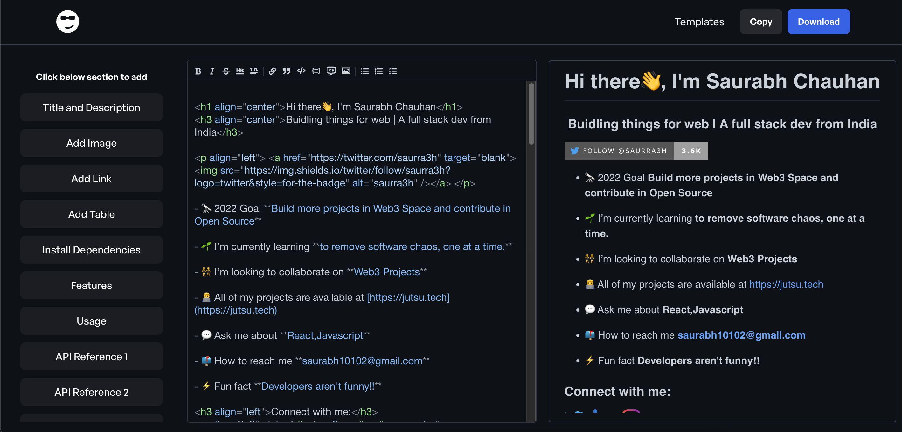

# 
Readmi

   Create your `README` in no time for your project
     
    <a href="https://readmi.xyz">View Demo</a>
    ·
    <a href="https://github.com/starc007/readmi/issues">Report Bug</a>
    ·
    <a href="https://github.com/starc007/readmi/issues">Request Feature</a>
  

 

## ➤ Features

- Edit and Download Existing Template
- Add prebuilt sections
- Download or copy your file

## ➤ Tech Stack

- [React](https://reactjs.org/)
- [TypeScript](https://www.typescriptlang.org/)
- [Tailwind CSS](https://tailwindcss.com/)
- [React MD Editor](https://github.com/uiwjs/react-md-editor)

## ➤ Contributing

Contributions are what make the open source community such an amazing place to be learn, inspire, and create. Any contributions you make are **greatly appreciated**.

Before contributing, please read the [contributing guidelines](CONTRIBUTING.md).

## Support ❤️

A simple star to this project repo is enough to keep me motivated on this project for days. If you find your self very much excited with this project let me know with a tweet.

If you have any questions, feel free to reach out to me on [Twitter](https://twitter.com/saurra3h).

 
 

## ➤ License

Distributed under the [MIT](LICENSE.txt) License. See [LICENSE](LICENSE.txt) for more information.

This readme was created with [readmi.xyz](https://readmi.xyz) ❤️
